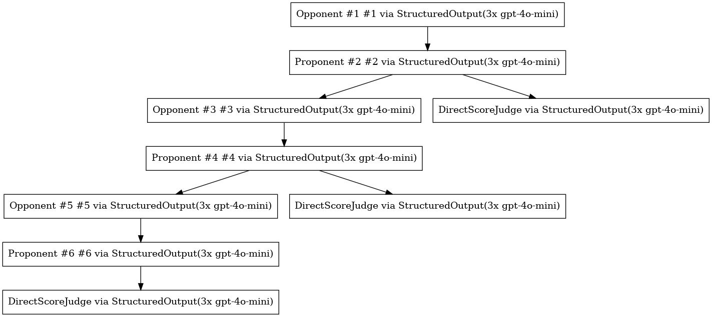

<div align="center">


**[Paper](https://verdict.haizelabs.com/draft.pdf) | [Docs](https://verdict.haizelabs.com/docs) | [Results](https://verdict.haizelabs.com)**

``` bash
pip install verdict
```
</div>

----

[](https://pypi.org/project/verdict/)
[](https://pypistats.org/packages/verdict)
[](https://discord.gg/CzfKnCMvwx)

### Building Judges that Actually Work

Automated correctness checks using LLMs, a.k.a. *LLM-as-a-judge*, is a widely adopted practice for both developers and researchers building LLM-powered applications. However, LLM judges are painfully unreliable. Today's LLM judges struggle with inconsistent output formats, mode collapse, miscalibrated confidence, superficial biases towards answer positioning, data frequency, model family, length, style, tone, safety, and numerous other failure modes. This makes the problem of evaluation doubly onerous: both the evaluator and evaluatee are unreliable. 

One promising solution is to **scale up judge-time compute** &mdash; the number of inference tokens used for judging. We do this in a very particular way: by composing judge architectural primitives grounded in the scalable oversight, automated evaluation, and generative reward modeling research. 

This is the foundation of **Verdict**, our library for scaling up judge-time compute. 

<figure>
  
  <figcaption>Example of a Verdict judge protocol: three pairs of LLMs engage in debates, and the outcomes of these debates are aggregated to produce a final verdict.</figcaption>
</figure>


### Verdict Scales Up Judge-Time Compute

Verdict provides the primitives (`Unit`; `Layer`; `Block`), composition of primitives, and execution framework for building complex, composable, compound judge protocols. Instead of a single LLM call, Verdict judges synthesize multiple units of reasoning, verification, debate, and aggregation. 

> [!IMPORTANT]
> 
> Verdict's primary contributions are as follows:
> 1. Verdict provides a **single interface** for implementing a potpourri of prompting strategies, bias mitigations, and architectures grounded in frontier research. We support insights from the fields of automated evaluation, scalable oversight, safety, fact-checking, reward modeling, and more. 
> 2. Verdict naturally introduces **powerful reasoning primitives and patterns** for automated evaluation, such as hierarchical reasoning verification and debate-aggregation.
> 3. Verdict is **fully composable**, allowing arbitrary reasoning patterns to be stacked into **expressive and powerful architectures**.
> 4. Judges built using Verdict require **no special fitting** but still achieve **SOTA or near-SOTA** performance on a wide variety of challenging automated evaluation tasks spanning safety moderation, hallucination detection, reward modeling, and more.

<!-- These features enable researchers and practitioners to iterate towards super-frontier judging capabilities with ease. -->

Scaling judge-time compute works astonishingly well. For example, Verdict judges achieve [SOTA or near-SOTA](https://verdict.haizelabs.com/) for content moderation, hallucination detection, and fact-checking. 

### Verdict for Evaluation, Verification, and Reinforcement Learning

Verdict judges can be used anywhere to replace human feedback and verification. Naturally, they apply to at least the following scenarios:

> [!TIP]
> 1. **Automated Evaluation of AI Applications**. Verdict judges enable *tailored* and *automated* evaluation of AI applications.
> 2. **Run-Time Guardrails**. Verdict judges are *guardrails* that sit on top of AI applications running in production.
> 3. **Test-Time Compute Scaling**. Verdict judges are verifiers that help rank, prune, and select candidates during test-time compute scaling.
> 4. **Reward Modeling & Reinforcement Learning**. Verdict judges provide signal in reinforcement learning &mdash; particularly in settings where rewards are not verifiable.

<!-- In each of the above scenarios, Verdict judges are the clear choice of Evaluator, Verifier, or Reward Model for at least the following reasons:

1. **Generalizability**. Verdict judges are more general than task-specific fine-tuned models. Verdict readily applies across different tasks and domains, as seen by our experiments on safety moderation, factual and logical correctness, and hallucination detection.
2. **Reliability**. Verdict judges are more stable, accurate, and reliable compared to simple LLM judges. Verdict judges beat out simple LLM judges, fine-tuned evaluators, and even `o1`-style reasoning models on our benchmarks.
3. **Saliency**. Verdict judges are capable of generating dense partial rewards, unlike (non-ML) verifiers in settings like mathematics or programming.
4. **Efficiency**. Verdic judges are just as powerful as –– if not more powerful than –– `o1`-style models at evaluation while being much lower-latency and cost-efficient. This is necessary for any method leveraging heavy inference-time compute. -->

