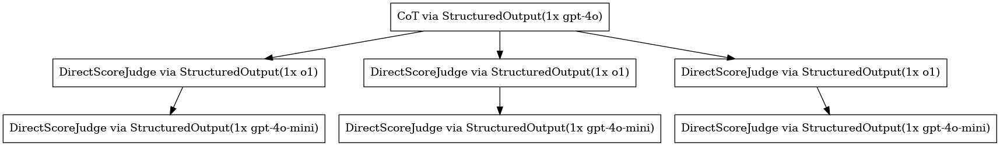

## Usage
To specify the model to use for a particular `Unit`'s execution, simply pass the model name to the `via()` method. By default, `Verdict` will use `litellm` to infer the model's connection parameters from [the short-name passed](https://github.com/BerriAI/litellm/blob/main/model_prices_and_context_window.json) to the `via()` method. Refer to the [LiteLLM Python SDK docs](https://docs.litellm.ai/#litellm-python-sdk) for more information. In particular, take note of the [provider API keys](https://docs.litellm.ai/docs/set_keys) you may need to set.

```python
...
>> JudgeUnit.via('gpt-4o-mini') # be sure to set your OPENAI_API_KEY
>> JudgeUnit.via('claude-3') # be sure to set your ANTHROPIC_API_KEY
>> JudgeUnit.via('deepinfra/meta-llama/Meta-Llama-3.1-8B-Instruct') # be sure to set your DEEPINFRA_API_KEY
```

In addition, we support hosted vLLM endpoints.
```python
from verdict.model import vLLMModel
model = vLLMModel(
    "meta-llama/Meta-Llama-3-8B-Instruct",
    api_base=".../v1",
    api_key="..."
)

...
>> JudgeUnit.via(model)
```

The `.via()` directive will cascade down to all sub-`Unit`s unless they have had their own `.via()` directive applied.
```python
from verdict import Layer
from verdict.common.cot import CoTUnit
from verdict.common.judge import JudgeUnit

ensemble = CoTUnit().via('gpt-4o') \
>> Layer(
    JudgeUnit(explanation=True).via('o1') \
    >> JudgeUnit()
, 3).via('gpt-4o-mini')

ensemble.materialize().plot()
```



## Retries
We bypass all `litellm`/`instructor`/provider-client retry mechanisms and roll our own retry logic. Simply pass the retries parameter to the `via()` method and `Verdict` will automatically retry all [recoverable inference-time errors](../../programming-model/executor.md#unit-execution-lifecycle).
```python
>> JudgeUnit.via('gpt-4o-mini', retries=3)
```

## Inference Parameters
All other keyword arguments passed to the `via()` method will be passed to the model's `completion` method. Here is where you can specify any standard inference parameters such as `temperature`, `max_tokens`, etc.

```python
>> JudgeUnit.via('gpt-4o-mini', temperature=1.2)
```

## Rate Limiting
Refer to the [Rate Limiting](./rate-limit.md) section.

## Advanced
### Model Selection Policy
As an extension of the retry logic, `Verdict` also supports a general model selection precedence policy. This can be useful, for example, in cases where a weaker model may suffice in a majority of cases, but you want to fallback to a more capable model in the event of failure (eg, `Unit#validate` does not succeed).

```python
...
>> JudgeUnit.via(ModelSelectionPolicy.from_names([
    #       model ,  retries,  inference parameters
    ('gpt-4o-mini',        1,    {temperature: 1.2}),
    (     'gpt-4o',        3,    {temperature: 0.9}),
]))
```

