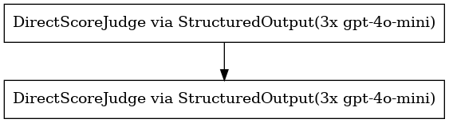
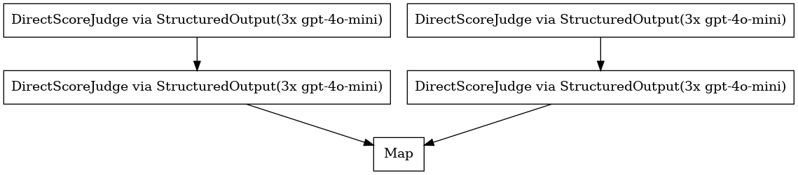
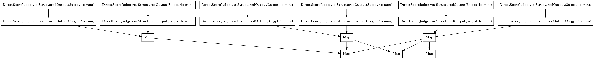
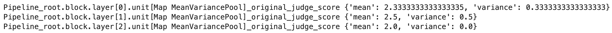
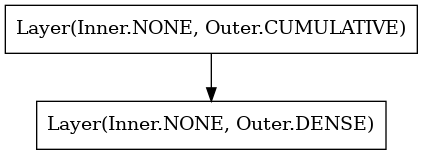

At the core of Verdict's programming model is a directed acyclic graph (DAG) of execution Units. Our high-level DSL helps you define this dependency graph in a declarative manner. We'll begin with a motivating example and then dive into the primitives.

## Motivating Example
Suppose you are trying to improve the performance of an LLM Judge. One way to do this is hierarchically apply another LLM Judge to evaluate the original judge’s score and explanation for logical consistency.

We define such a flow below using the [built-in](../concept/unit.md#built-ins) `JudgeUnit`. A `Unit` encapsulates a single LLM call as well as context from dependencies.

```python
from verdict.common.judge import JudgeUnit
from verdict.scale import DiscreteScale

judge = JudgeUnit(DiscreteScale((1, 5)), explanation=True).prompt("""
  Rate how the agent empathizes with the customer.

  Conversation:
  {source.conversation}
""")

judge_of_judge = JudgeUnit(DiscreteScale((0, 5))).prompt("""
  Rate how logical the LLM Judge's evaluation and explanation is with regard to the original task of scoring empathy.

  Conversation:
  {source.conversation}

  LLM Judge's Score:
  {previous.score}

  LLM Judge's Explanation:
  {previous.explanation}
""")

(judge >> judge_of_judge).plot(display=True)
```


## Layers are Ensembles of Judges

It is well known that a single-call Judges are brittle evaluators. To remedy this, we can define a `Layer` to run *multiple judges* in an ensemble. In the example below, we then take the best scoring hierarchical judge.

A `Layer` executes multiple copies of an underlying sub-graph. For instance, the `Layer` below runs 2 copies of the `judge >> judge_of_judge` graph.

We will call this ensemble a **jury**.

```python
from verdict import Layer
from verdict.common.judge import JudgeUnit
from verdict.transform import MapUnit

jury = Layer(
    judge >> judge_of_judge
, 2) \
    >> MapUnit(lambda outputs: max(outputs, key=lambda output: output.score))

jury.materialize().plot(display=True)
```


## Blocks are Sub-Graphs
This is a good start!

We can further study how this **jury** performs by running it across multiple trials. We do this by creating another `Layer` of several jury objects, and then hooking on a `MeanVariancePoolUnit` to report the mean and variance of each jury’s scores.

```python
from verdict.transform import MeanVariancePoolUnit

block = Layer(jury, 3) \
    >> MeanVariancePoolUnit("score")

block.materialize().plot(display=True)
```


Note above that we're now calling our `Layer` a `Block`.

A `Block` is simply a sub-graph, whose nodes are all other primitives, such as `Unit`, `Layer`, or `Block`. Blocks allows us to re-use common architectures within larger pipelines. In the example above, our `jury` is a `Block` that came in handy for re-use!

Under the hood, Verdict automatically constructs a root `Block` as any primitive dependencies are defined with the `>>` operator.

## Data Propagation
A keen eye may have noticed a subtle error with the above example -- we are reporting the mean of the `judge_on_judge` scores when actually want to report the mean of the original `judge` scores!

By default, Verdict passes the previous `Unit`'s output to the next `Unit`'s input. However, we can also define custom logic to [propagate data](../concept/transform.md#propagate).

```python
from verdict.schema import Schema

jury = Layer(
    judge >> judge_of_judge.propagate(lambda unit, previous, input, output: Schema.of(
        original_judge_score=previous.score,
        judge_of_judge_score=output.score
    )) \
, 2) \
    >> MapUnit(lambda outputs: max(outputs, key=lambda output: output.judge_of_judge_score))

block = Layer(jury, 3) \
    >> MeanVariancePoolUnit("original_judge_score")
```

## Experiment

Great! We’ve defined a pretty complex pipeline that:
1. Runs 2 judges in parallel
2. Has another judge evaluate the underlying judge explanation for logical consistency, and picks the judge with the best explanation
3. Extracts the original score from the best judge
4. Runs this strategy in parallel 3 times and reports the mean and variance.

The fun doesn’t stop here :smile:

Suppose we want to understand how the variance of our jury changes as we vary the number of trials. We can use the Layer([outer='cumulative'](../concept/layer.md)) option to report a running mean and variance.

```python
experiment = Layer(jury, 3, outer='cumulative') \
    >> Layer(MeanVariancePoolUnit("original_judge_score"), 3)

experiment.materialize().plot(display=True)
```


Note how primitives are composable – there is no limitation that a `Layer` must only be built from `Unit`s.

As you can see, Verdict’s underlying graph model allows us to define and re-use incredibly flexible and modular components, making it simple to iterate on complex evaluation pipelines.

## Putting It All Together
Here is a simple example of how to run a pipeline on a single sample. Refer to the [Pipeline](../concept/pipeline.md) section for more details on how to run a pipeline.

```python
from verdict import Pipeline

pipeline = Pipeline() >> experiment
response, leaf_unit_prefixes = pipeline.run(Schema.of(
    conversation="Customer: I needed that package by my neice's birthday and it didn't arive.\nAgent: One moment."
))

for leaf_unit in leaf_unit_prefixes:
    print(leaf_unit, response[leaf_unit])
```


## Materialization
Recall that a `Block` is a recursive graph structure; however, our [execution model](../programming-model/executor.md#pipeline-execution-lifecycle) requires a flat list of `Unit`s. We first materialize all recursive structures into a graph of `Unit`s via the `.materialize()` method. As an instructive example, observe what the `experiment` block above looks like before materialization.

||| :icon-code: Source
```python
experiment.plot(display=True)
```
||| :icon-eye: Output

|||
